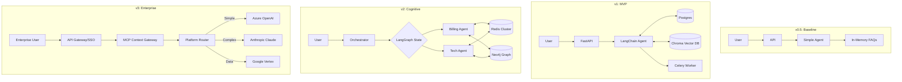

# SupportMax Pro: Architectural Evolution & Feature Comparison

In the development of **SupportMax Pro**—our intelligent customer support platform—we don't just jump straight to a complex microservices architecture. Instead, we build it layer by layer, addressing specific enterprise pains at each stage.

Here is the detailed breakdown of how features and capabilities evolve from `v0.5` to `v3.0`, and how they align with the chapters in **"Agentic AI Systems Architecture"**.

## 1. Version 0.5: The Baseline Foundation
**Aligns with:** *Chapter 1 (Production Constraints) & Chapter 2 (Core Components)*

This is the "Hello World" of production systems. It is not features-complete, but it is **constraints-complete**. Before we build fancy cognitive features, we establish the rules of the road: latency, cost, and reliability.

*   **Core Philosophy:** "Constraints First." If the agent takes 30 seconds to reply or costs $5 per query, it fails regardless of how smart it is.
*   **Key Capabilities Added:**
    *   **Perception-Reasoning-Action Loop:** The fundamental atomic unit of the agent.
    *   **Production Constraints Engine:** Strict runtime checks for latency (<2s) and token usage.
    *   **In-Memory "Brain":** Simple keyword-based FAQ search (no vector DB yet).
    *   **Basic Tool Use:** Can "create a ticket" in a mock system.
*   **Architecture:** Monolithic, single-turn, stateless (resets on restart).
*   **Why this matters:** It proves we can build an agent that respects enterprise SLAs before we add complexity.

## 2. Version 1.0: The MVP (Vertical Slice)
**Aligns with:** *Chapter 3 (Baseline Architecture & Vertical Slice)*

This represents the "Walking Skeleton"—a complete, end-to-end functionality vertical slice. It connects the agent to the real world and gives it persistent memory.

*   **Core Philosophy:** "Viability." It must solve a real user problem from start to finish.
*   **Key Capabilities Added:**
    *   **Persistence Layer:** PostgreSQL for storing tickets, users, and interaction logs.
    *   **Semantic Intelligence:** Replaced keyword search with **Chroma Vector Store** for semantic understanding of help articles.
    *   **Asynchronous Processing:** Introduced **Celery & Redis** to handle background tasks (e.g., email ingestion) without blocking the user.
    *   **Multi-Turn Context:** The agent now remembers what you said three messages ago (Session Management).
    *   **Basic Integrations:** Real connection to Email (IMAP/SMTP) and a basic Salesforce mock.
*   **Architecture:** Dockerized multi-container setup (API + Worker + DB + Cache).
*   **Why this matters:** This is the first version you could actually show to a customer. It works, handles context, and persists data.

## 3. Version 2.0: Cognitive Enhancement
**Aligns with:** *Part 2 (Chapters 4-6) & Part 3 (Chapters 7-9)*

This is where the system becomes "Smart." We move from a simple chatbot to a **Cognitive Architecture**. We realize that a single LLM loop isn't enough for complex billing disputes or technical debugging.

*   **Core Philosophy:** "Specialization & Cognition." Complex problems require specialized thinkers and distributed memory.
*   **Key Capabilities Added:**
    *   **Distributed Memory Hierarchy:**
        *   *Short-term:* **Redis Cluster** for low-latency session state.
        *   *Long-term:* **Vector DB** for semantic history.
        *   *Graph:* **Neo4j Knowledge Graph** to understand relationships (e.g., "User A owns Product B which has Incident C").
    *   **Multi-Agent Orchestration (CrewAI):** Instead of one generic bot, we have specialized roles:
        *   *Billing Specialist* (Check invoices, process refunds).
        *   *Technical Specialist* (Read logs, diagnose bugs).
    *   **Advanced Flow Engineering (LangGraph):** Replaced simple chains with State Machines. We can now loop, backtrack, and handle conditionals (e.g., "If confidence < 0.7, ask clarifying question").
    *   **Advanced RAG:** Query decomposition and hybrid search (Keyword + Vector + Graph).
*   **Architecture:** Event-driven, distributed agents, graph-backed consistency.
*   **Why this matters:** v1 fails on complex queries like *"Why is my bill higher this month given my usage?"*. v2 solves this by coordinating a billing agent and a usage agent, grounded in a knowledge graph.

## 4. Version 3.0: Enterprise Integration & Scale
**Aligns with:** *Part 3 (Chapters 9-10) & Part 4 (Chapters 11-13)*

This is the "Enterprise Grade" release. It addresses the reality of large organizations: they use multiple clouds, have strict security (SSO/RBAC), and don't want vendor lock-in.

*   **Core Philosophy:** "Scale, Security, & Independence." Running 10,000 agents securely across multiple cloud providers.
*   **Key Capabilities Added:**
    *   **Model Context Protocol (MCP):** A unified standard for agents to exchange context and tools, regardless of their underlying model.
    *   **Multi-Platform Routing:** The "Platform Coordinator" dynamically routes queries based on cost/performance. Simple query? Route to Haiku/GPT-3.5. Complex reasoning? Route to Claude 3.5 Sonnet/GPT-4o.
    *   **Enterprise Security:**
        *   **SSO:** Integration with Azure AD / Okta.
        *   **Service Mesh (Istio):** mTLS encryption between agents.
    *   **Global Scale:** Multi-region deployment patterns (e.g., US-East and EU-West failover).
*   **Architecture:** Microservices, Service Mesh, Gateway-pattern, Multi-Cloud/Hybrid.
*   **Why this matters:** This enables the company to say "We are compliant" and "We are cost-efficient" while running at a global scale.

---

## Detailed Comparison Matrix

| Feature Category       | **v0.5 Baseline**        | **v1.0 MVP**         | **v2.0 Cognitive**                                      | **v3.0 Enterprise**                       |
| :--------------------- | :----------------------- | :------------------- | :------------------------------------------------------ | :---------------------------------------- |
| **Book Chapters**      | **Ch 1-2**               | **Ch 3**             | **Ch 4-9**                                              | **Ch 10-17**                              |
| **Primary Goal**       | Prove Constraints & Loop | End-to-End Viability | Intelligence & Reasoning                                | Scale, Security, Integration              |
| **Agent Architecture** | Single Loop (P-R-A)      | Single Loop + Memory | **Multi-Agent (CrewAI)** + State Machine (LangGraph)    | **Multi-Platform** (OpenAI/Azure/GCP)     |
| **Memory**             | In-Memory (Ephemeral)    | Postgres + Vector    | **Distributed Hierarchy** (Redis Cluster + Neo4j Graph) | **MCP Gateway** + Context Synchronization |
| **Search/RAG**         | Keyword Match            | Semantic (Vector)    | **Hybrid** (Vector + Graph + Keyword)                   | Federated Enterprise Search               |
| **Orchestration**      | Python Functions         | Simple Chains        | **StateGraphs** (Cyclic, Conditional)                   | Service Mesh (Istio) & Event Bus          |
| **Deployment**         | Docker (Single)          | Docker Compose       | Kubernetes (K8s)                                        | **Multi-Region / Multi-Cloud**            |
| **Security**           | None                     | Basic API Keys       | Role-Based Access                                       | **SSO (SAML/OIDC)** + mTLS                |
| **Throughput**         | ~50/day                  | ~500/day             | ~5,000/day                                              | **10,000+/day**                           |

---

## Visualizing the Evolution

Here is how the architecture grows from the Baseline to the Enterprise system.

