# SupportMax Pro: Comprehensive Implementation Roadmap

## Production-Scale Deployment Evolution Across Architecture Versions

This roadmap provides a detailed implementation plan demonstrating how the SupportMax Pro intelligent customer support platform evolves from a simple baseline agent (Architecture v0.5) to a globally distributed, multi-cloud enterprise system (Architecture v6). Each part of the book adds new capabilities while maintaining production readiness at every stage.

---

## Executive Summary: Architecture Evolution Overview

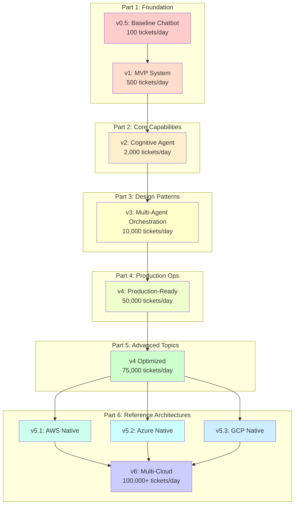
```mermaid
graph TB
    subgraph "Part 1: Foundation"
        V05[v0.5: Baseline Chatbot<br/>100 tickets/day]
        V1[v1: MVP System<br/>500 tickets/day]
    end

    subgraph "Part 2: Core Capabilities"
        V2[v2: Cognitive Agent<br/>2,000 tickets/day]
    end

    subgraph "Part 3: Design Patterns"
        V3[v3: Multi-Agent Orchestration<br/>10,000 tickets/day]
    end

    subgraph "Part 4: Production Ops"
        V4[v4: Production-Ready<br/>50,000 tickets/day]
    end

    subgraph "Part 5: Advanced Topics"
        V4O[v4 Optimized<br/>75,000 tickets/day]
    end

    subgraph "Part 6: Reference Architectures"
        V51[v5.1: AWS Native]
        V52[v5.2: Azure Native]
        V53[v5.3: GCP Native]
        V6[v6: Multi-Cloud<br/>100,000+ tickets/day]
    end

    V05 --> V1
    V1 --> V2
    V2 --> V3
    V3 --> V4
    V4 --> V4O
    V4O --> V51
    V4O --> V52
    V4O --> V53
    V51 --> V6
    V52 --> V6
    V53 --> V6

    style V05 fill:#ffcccc
    style V1 fill:#ffddcc
    style V2 fill:#ffeecc
    style V3 fill:#ffffcc
    style V4 fill:#eeffcc
    style V4O fill:#ccffcc
    style V51 fill:#ccffee
    style V52 fill:#ccffff
    style V53 fill:#cceeff
    style V6 fill:#ccccff
```

---

## Part 1: Production Realities and Foundation

### Vertical Slice Objective

Build a complete, working customer support agent that can process tickets end-to-end, demonstrating all core agentic AI concepts in a minimal but functional system.

### Architecture v0.5: Baseline Chatbot (Chapter 1)

**Business Capability**: Simple FAQ bot that can answer common questions and create tickets for unresolved queries.

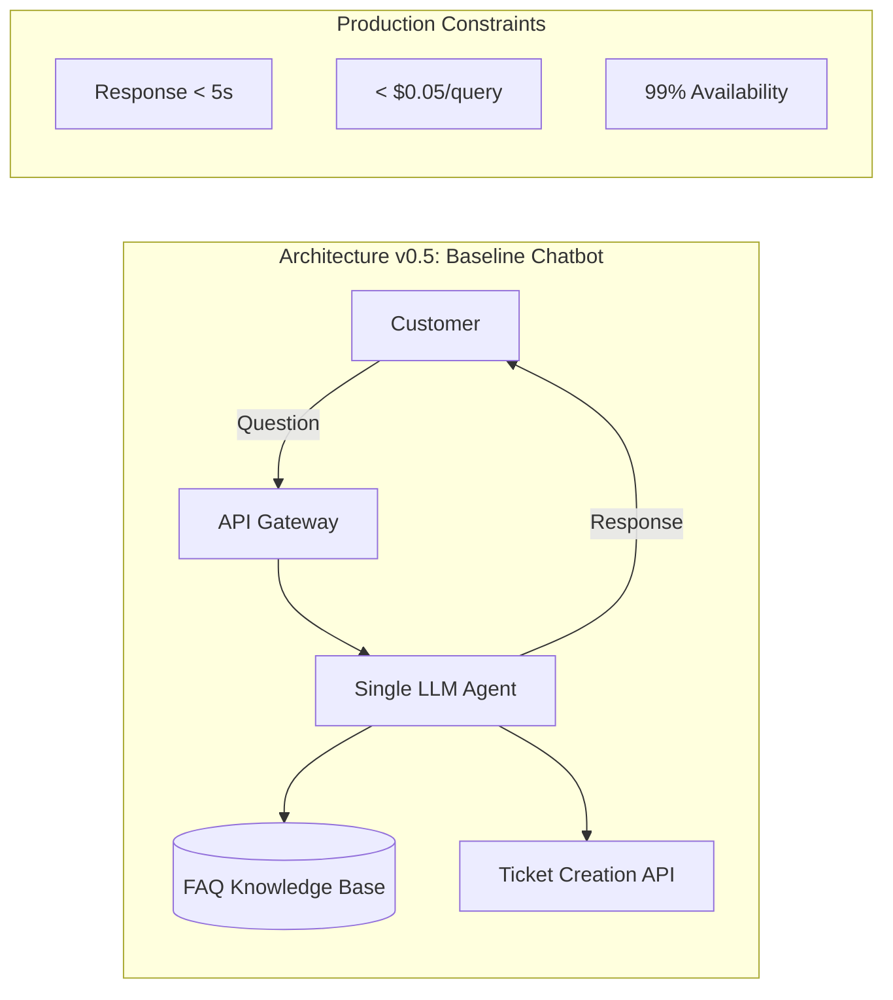
```mermaid
flowchart LR
    subgraph "Architecture v0.5: Baseline Chatbot"
        Customer[Customer] -->|Question| Gateway[API Gateway]
        Gateway --> Agent[Single LLM Agent]
        Agent --> KB[(FAQ Knowledge Base)]
        Agent --> TicketAPI[Ticket Creation API]
        Agent -->|Response| Customer
    end

    subgraph "Production Constraints"
        SLA[Response < 5s]
        Cost[< $0.05/query]
        Uptime[99% Availability]
    end
```

**Implementation Focus**:

| Component      | Technology                                | Production Constraint  |
| -------------- | ----------------------------------------- | ---------------------- |
| LLM            | GPT-4o-mini or Claude 3 Haiku             | Cost optimization      |
| Knowledge Base | Simple vector store (SQLite + embeddings) | Minimal infrastructure |
| API            | FastAPI with rate limiting                | Latency < 2 seconds    |
| Monitoring     | Basic logging                             | Audit trail            |

**Quantifiable Outcomes for v0.5**:

- Handle 100 tickets/day
- 50% automated FAQ resolution
- Average response time: 3 seconds
- Cost per interaction: $0.03
- Single region deployment

**Code Structure**:

```
/supportmax_pro/
├── v0_5_baseline/
│   ├── agent.py              # Simple ReAct agent
│   ├── knowledge_base.py     # FAQ retrieval
│   ├── ticket_api.py         # Basic ticket creation
│   ├── config.py             # Production constraints
│   └── main.py               # FastAPI application
```

---

### Architecture v1: MVP System (Chapters 2-3)

**Business Capability**: Complete ticket processing pipeline with classification, routing, and basic automation.

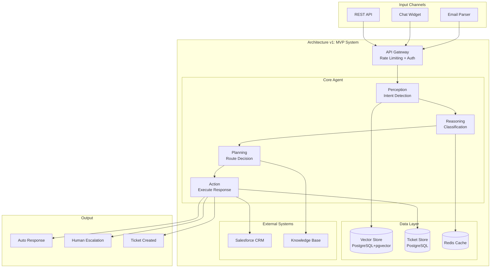
```mermaid
flowchart TB
    subgraph "Input Channels"
        Email[Email Parser]
        Chat[Chat Widget]
        API[REST API]
    end

    subgraph "Architecture v1: MVP System"
        Gateway[API Gateway<br/>Rate Limiting + Auth]

        subgraph "Core Agent"
            Perception[Perception<br/>Intent Detection]
            Reasoning[Reasoning<br/>Classification]
            Planning[Planning<br/>Route Decision]
            Action[Action<br/>Execute Response]
        end

        subgraph "Data Layer"
            VectorDB[(Vector Store<br/>PostgreSQL+pgvector)]
            TicketDB[(Ticket Store<br/>PostgreSQL)]
            Cache[(Redis Cache)]
        end

        subgraph "External Systems"
            CRM[Salesforce CRM]
            KB[Knowledge Base]
        end
    end

    subgraph "Output"
        Response[Auto Response]
        Escalation[Human Escalation]
        Ticket[Ticket Created]
    end

    Email --> Gateway
    Chat --> Gateway
    API --> Gateway

    Gateway --> Perception
    Perception --> Reasoning
    Reasoning --> Planning
    Planning --> Action

    Perception --> VectorDB
    Reasoning --> Cache
    Planning --> KB
    Action --> CRM
    Action --> TicketDB

    Action --> Response
    Action --> Escalation
    Action --> Ticket
```

**Detailed Component Architecture**:

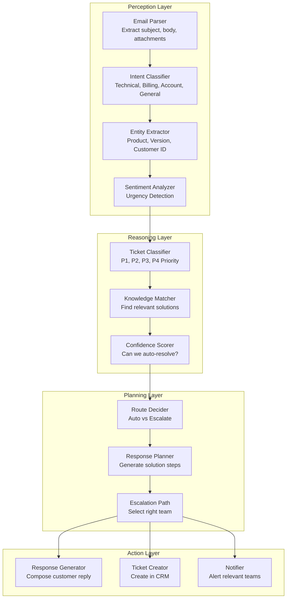
```mermaid
flowchart TB
    subgraph "Perception Layer"
        P1[Email Parser<br/>Extract subject, body, attachments]
        P2[Intent Classifier<br/>Technical, Billing, Account, General]
        P3[Entity Extractor<br/>Product, Version, Customer ID]
        P4[Sentiment Analyzer<br/>Urgency Detection]
    end

    subgraph "Reasoning Layer"
        R1[Ticket Classifier<br/>P1, P2, P3, P4 Priority]
        R2[Knowledge Matcher<br/>Find relevant solutions]
        R3[Confidence Scorer<br/>Can we auto-resolve?]
    end

    subgraph "Planning Layer"
        PL1[Route Decider<br/>Auto vs Escalate]
        PL2[Response Planner<br/>Generate solution steps]
        PL3[Escalation Path<br/>Select right team]
    end

    subgraph "Action Layer"
        A1[Response Generator<br/>Compose customer reply]
        A2[Ticket Creator<br/>Create in CRM]
        A3[Notifier<br/>Alert relevant teams]
    end

    P1 --> P2 --> P3 --> P4
    P4 --> R1
    R1 --> R2 --> R3
    R3 --> PL1
    PL1 --> PL2 --> PL3
    PL3 --> A1
    PL3 --> A2
    PL3 --> A3
```

**Implementation Milestones for Part 1**:

| Milestone | Deliverable              | Success Criteria          |
| --------- | ------------------------ | ------------------------- |
| M1.1      | Email intake pipeline    | Parse 1000 emails/hour    |
| M1.2      | Intent classification    | 85% accuracy on test set  |
| M1.3      | Knowledge retrieval      | < 500ms retrieval time    |
| M1.4      | Auto-response generation | 70% automated resolution  |
| M1.5      | CRM integration          | Bidirectional sync < 1s   |
| M1.6      | Dashboard MVP            | Real-time metrics display |

**Quantifiable Outcomes for v1**:

- Handle 500 tickets/day
- 70% automated resolution rate
- Average resolution time: 4 hours (down from 4.2 days baseline)
- Cost per ticket: $1.50 (down from $2.50 baseline)
- Customer satisfaction: 3.8/5 (up from 3.2/5)

**Technology Stack**:

```yaml
infrastructure:
  compute: Docker Compose (local) / Single EC2 instance
  database: PostgreSQL 16 with pgvector
  cache: Redis 7
  queue: Redis Streams (simple)

frameworks:
  orchestration: LangGraph (state machine)
  llm_client: LangChain
  api: FastAPI

observability:
  logging: Structured JSON logs
  metrics: Prometheus + Grafana
  tracing: Basic request IDs
```

---

## Part 2: Expanding Core Capabilities

### Vertical Slice Objective

Transform the basic agent into a cognitive system with enterprise-grade memory, context management, and multi-turn conversation handling.

### Architecture v2: Cognitive Agent System (Chapters 4-6)

**Business Capability**: Personalized support with customer history awareness, complex multi-step problem solving, and cross-conversation learning.

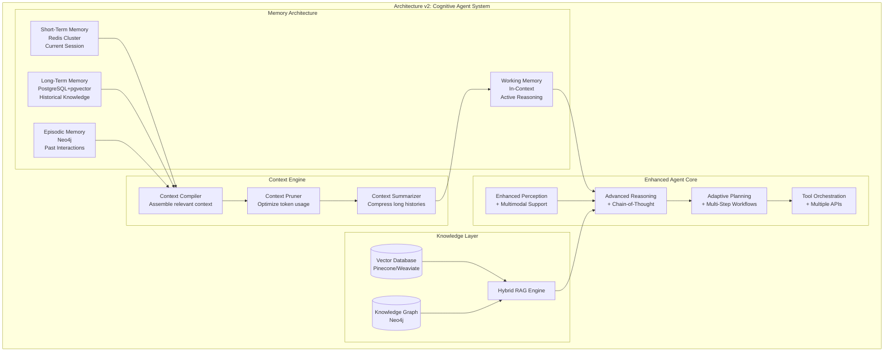
```mermaid
flowchart TB
    subgraph "Architecture v2: Cognitive Agent System"
        subgraph "Memory Architecture"
            STM[Short-Term Memory<br/>Redis Cluster<br/>Current Session]
            WM[Working Memory<br/>In-Context<br/>Active Reasoning]
            LTM[Long-Term Memory<br/>PostgreSQL+pgvector<br/>Historical Knowledge]
            EM[Episodic Memory<br/>Neo4j<br/>Past Interactions]
        end

        subgraph "Context Engine"
            CE[Context Compiler<br/>Assemble relevant context]
            CP[Context Pruner<br/>Optimize token usage]
            CS[Context Summarizer<br/>Compress long histories]
        end

        subgraph "Enhanced Agent Core"
            Perception[Enhanced Perception<br/>+ Multimodal Support]
            Reasoning[Advanced Reasoning<br/>+ Chain-of-Thought]
            Planning[Adaptive Planning<br/>+ Multi-Step Workflows]
            Action[Tool Orchestration<br/>+ Multiple APIs]
        end

        subgraph "Knowledge Layer"
            VDB[(Vector Database<br/>Pinecone/Weaviate)]
            KG[(Knowledge Graph<br/>Neo4j)]
            RAG[Hybrid RAG Engine]
        end
    end

    STM --> CE
    LTM --> CE
    EM --> CE
    CE --> CP --> CS --> WM

    WM --> Reasoning
    Perception --> Reasoning
    Reasoning --> Planning
    Planning --> Action

    VDB --> RAG
    KG --> RAG
    RAG --> Reasoning
```

**Detailed Memory System Architecture**:


```mermaid
flowchart TB
    subgraph "Memory Hierarchy for SupportMax Pro"
        subgraph "Layer 1: Session Memory (Redis)"
            SM1[Current Conversation<br/>Last 10 messages]
            SM2[Active Context<br/>Customer info, ticket details]
            SM3[Tool Execution State<br/>API calls in progress]
        end

        subgraph "Layer 2: Customer Memory (PostgreSQL)"
            CM1[Customer Profile<br/>Subscription, tier, preferences]
            CM2[Interaction History<br/>Past 50 tickets summarized]
            CM3[Product Configuration<br/>Installed versions, features]
            CM4[Satisfaction Trends<br/>NPS history, pain points]
        end

        subgraph "Layer 3: Organizational Memory (Vector + Graph)"
            OM1[Solution Knowledge Base<br/>10,000+ resolution patterns]
            OM2[Product Documentation<br/>Technical reference]
            OM3[Agent Learnings<br/>What worked for similar issues]
            OM4[Cross-Customer Patterns<br/>Common issues by product version]
        end
    end

    subgraph "Memory Access Patterns"
        Read1[Fast Read<br/>< 10ms<br/>Session Memory]
        Read2[Medium Read<br/>< 100ms<br/>Customer Memory]
        Read3[Search Read<br/>< 500ms<br/>Organizational Memory]
    end

    SM1 --> Read1
    SM2 --> Read1
    SM3 --> Read1
    CM1 --> Read2
    CM2 --> Read2
    CM3 --> Read2
    CM4 --> Read2
    OM1 --> Read3
    OM2 --> Read3
    OM3 --> Read3
    OM4 --> Read3
```

**Context Engineering Pipeline**:

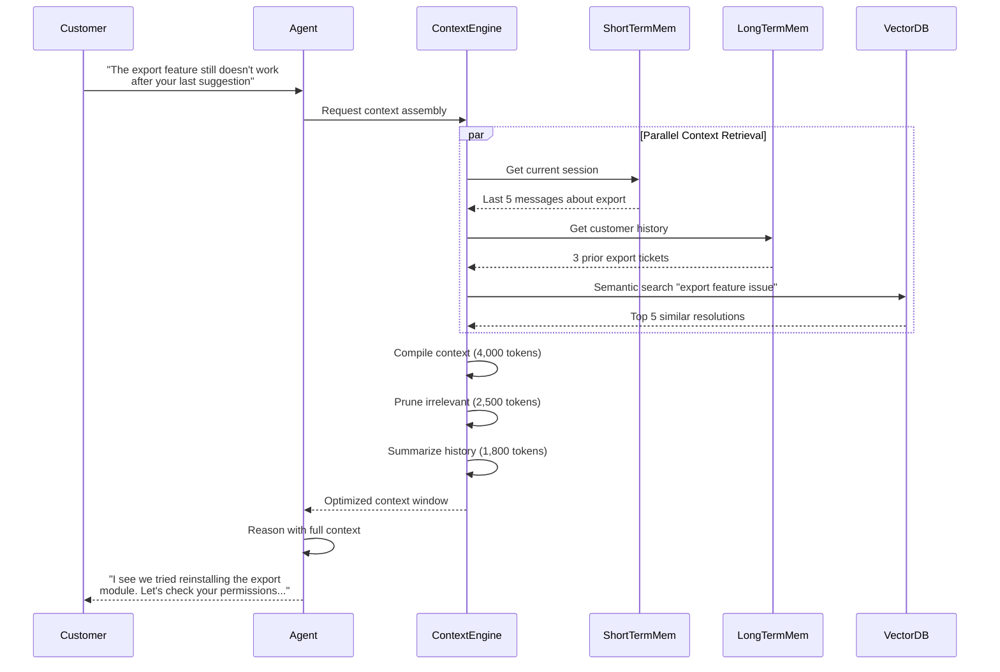
```mermaid
sequenceDiagram
    participant Customer
    participant Agent
    participant ContextEngine
    participant ShortTermMem
    participant LongTermMem
    participant VectorDB

    Customer->>Agent: "The export feature still doesn't work<br/>after your last suggestion"

    Agent->>ContextEngine: Request context assembly

    par Parallel Context Retrieval
        ContextEngine->>ShortTermMem: Get current session
        ShortTermMem-->>ContextEngine: Last 5 messages about export

        ContextEngine->>LongTermMem: Get customer history
        LongTermMem-->>ContextEngine: 3 prior export tickets

        ContextEngine->>VectorDB: Semantic search "export feature issue"
        VectorDB-->>ContextEngine: Top 5 similar resolutions
    end

    ContextEngine->>ContextEngine: Compile context (4,000 tokens)
    ContextEngine->>ContextEngine: Prune irrelevant (2,500 tokens)
    ContextEngine->>ContextEngine: Summarize history (1,800 tokens)

    ContextEngine-->>Agent: Optimized context window

    Agent->>Agent: Reason with full context
    Agent-->>Customer: "I see we tried reinstalling the export<br/>module. Let's check your permissions..."
```

**Implementation Milestones for Part 2**:

| Milestone | Deliverable                 | Success Criteria                         |
| --------- | --------------------------- | ---------------------------------------- |
| M2.1      | Redis Cluster memory        | Session persistence across restarts      |
| M2.2      | PostgreSQL+pgvector         | < 100ms semantic search on 100K docs     |
| M2.3      | Customer context builder    | Assemble context in < 200ms              |
| M2.4      | Multi-turn conversation     | Handle 20+ turn conversations            |
| M2.5      | Context optimization        | 40% token reduction with no quality loss |
| M2.6      | Cross-conversation learning | Improve resolution rate by 15%           |

**Quantifiable Outcomes for v2**:

- Handle 2,000 tickets/day
- 78% automated resolution rate (up from 70%)
- Multi-turn conversation success: 85%
- Context-aware personalization: 92% customer recognition
- Average resolution time: 1.5 hours
- Customer satisfaction: 4.2/5

**Production Memory Configuration**:

```yaml
memory_architecture:
  short_term:
    provider: Redis Cluster
    nodes: 3
    ttl: 24 hours
    max_session_size: 100KB

  long_term:
    provider: PostgreSQL 16
    extensions: [pgvector, pg_trgm]
    vector_dimensions: 1536
    index_type: HNSW

  vector_store:
    provider: Weaviate
    shards: 3
    replicas: 2
    index_type: HNSW
    ef: 256  # Search quality parameter

  knowledge_graph:
    provider: Neo4j
    mode: cluster
    nodes: 3

frameworks:
  memory: Mem0
  orchestration: LangGraph
  rag: LangChain
```

---

## Part 3: Design Patterns and System Architecture

### Vertical Slice Objective

Evolve from a single agent to a coordinated multi-agent system with specialized agents for different support domains.

### Architecture v3: Multi-Agent Orchestration (Chapters 7-10)

**Business Capability**: Specialized agents handling billing, technical, and account issues with intelligent routing and collaborative problem-solving.

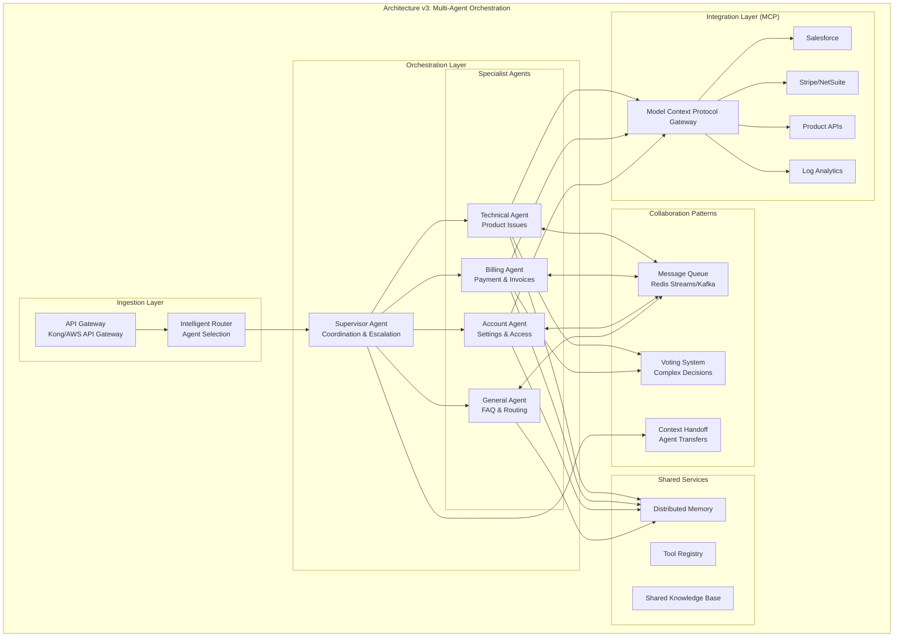
```mermaid
flowchart TB
    subgraph "Architecture v3: Multi-Agent Orchestration"
        subgraph "Ingestion Layer"
            Gateway[API Gateway<br/>Kong/AWS API Gateway]
            Router[Intelligent Router<br/>Agent Selection]
        end

        subgraph "Orchestration Layer"
            Supervisor[Supervisor Agent<br/>Coordination & Escalation]

            subgraph "Specialist Agents"
                TechAgent[Technical Agent<br/>Product Issues]
                BillingAgent[Billing Agent<br/>Payment & Invoices]
                AccountAgent[Account Agent<br/>Settings & Access]
                GeneralAgent[General Agent<br/>FAQ & Routing]
            end
        end

        subgraph "Collaboration Patterns"
            MQ[Message Queue<br/>Redis Streams/Kafka]
            Consensus[Voting System<br/>Complex Decisions]
            Handoff[Context Handoff<br/>Agent Transfers]
        end

        subgraph "Shared Services"
            Memory[Distributed Memory]
            Tools[Tool Registry]
            KB[Shared Knowledge Base]
        end

        subgraph "Integration Layer (MCP)"
            MCP[Model Context Protocol Gateway]
            CRM[Salesforce]
            Billing[Stripe/NetSuite]
            Product[Product APIs]
            Logs[Log Analytics]
        end
    end

    Gateway --> Router
    Router --> Supervisor

    Supervisor --> TechAgent
    Supervisor --> BillingAgent
    Supervisor --> AccountAgent
    Supervisor --> GeneralAgent

    TechAgent <--> MQ
    BillingAgent <--> MQ
    AccountAgent <--> MQ
    GeneralAgent <--> MQ

    TechAgent --> Consensus
    BillingAgent --> Consensus

    Supervisor --> Handoff

    TechAgent --> Memory
    BillingAgent --> Memory
    AccountAgent --> Memory
    GeneralAgent --> Memory

    MCP --> CRM
    MCP --> Billing
    MCP --> Product
    MCP --> Logs

    TechAgent --> MCP
    BillingAgent --> MCP
    AccountAgent --> MCP
```

**Agent Specialization Design**:

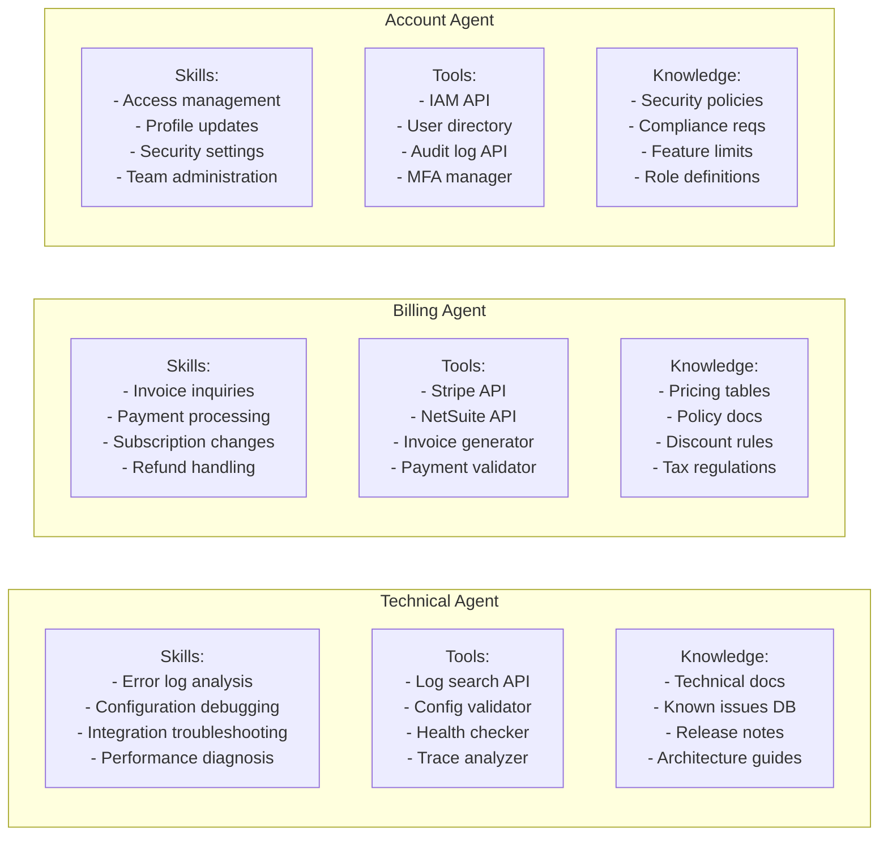
```mermaid
flowchart LR
    subgraph "Technical Agent"
        TA_Skills[Skills:<br/>- Error log analysis<br/>- Configuration debugging<br/>- Integration troubleshooting<br/>- Performance diagnosis]
        TA_Tools[Tools:<br/>- Log search API<br/>- Config validator<br/>- Health checker<br/>- Trace analyzer]
        TA_KB[Knowledge:<br/>- Technical docs<br/>- Known issues DB<br/>- Release notes<br/>- Architecture guides]
    end

    subgraph "Billing Agent"
        BA_Skills[Skills:<br/>- Invoice inquiries<br/>- Payment processing<br/>- Subscription changes<br/>- Refund handling]
        BA_Tools[Tools:<br/>- Stripe API<br/>- NetSuite API<br/>- Invoice generator<br/>- Payment validator]
        BA_KB[Knowledge:<br/>- Pricing tables<br/>- Policy docs<br/>- Discount rules<br/>- Tax regulations]
    end

    subgraph "Account Agent"
        AA_Skills[Skills:<br/>- Access management<br/>- Profile updates<br/>- Security settings<br/>- Team administration]
        AA_Tools[Tools:<br/>- IAM API<br/>- User directory<br/>- Audit log API<br/>- MFA manager]
        AA_KB[Knowledge:<br/>- Security policies<br/>- Compliance reqs<br/>- Feature limits<br/>- Role definitions]
    end
```

**Multi-Agent Communication Patterns**:

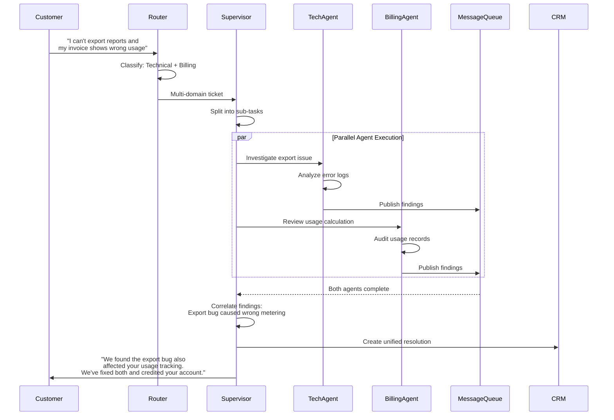
```mermaid
sequenceDiagram
    participant Customer
    participant Router
    participant Supervisor
    participant TechAgent
    participant BillingAgent
    participant MessageQueue
    participant CRM

    Customer->>Router: "I can't export reports and<br/>my invoice shows wrong usage"

    Router->>Router: Classify: Technical + Billing
    Router->>Supervisor: Multi-domain ticket

    Supervisor->>Supervisor: Split into sub-tasks

    par Parallel Agent Execution
        Supervisor->>TechAgent: Investigate export issue
        TechAgent->>TechAgent: Analyze error logs
        TechAgent->>MessageQueue: Publish findings

        Supervisor->>BillingAgent: Review usage calculation
        BillingAgent->>BillingAgent: Audit usage records
        BillingAgent->>MessageQueue: Publish findings
    end

    MessageQueue-->>Supervisor: Both agents complete

    Supervisor->>Supervisor: Correlate findings:<br/>Export bug caused wrong metering

    Supervisor->>CRM: Create unified resolution
    Supervisor->>Customer: "We found the export bug also<br/>affected your usage tracking.<br/>We've fixed both and credited your account."
```

**Design Pattern Implementation for SupportMax Pro**:


```mermaid
flowchart TB
    subgraph "Observer Pattern: SLA Monitoring"
        SLAMonitor[SLA Observer]
        TicketEvents[Ticket Events Stream]
        AlertService[Alert Service]
        EscalationEngine[Escalation Engine]

        TicketEvents -->|Subscribe| SLAMonitor
        SLAMonitor -->|P1 > 1hr| AlertService
        SLAMonitor -->|P1 > 2hr| EscalationEngine
    end

    subgraph "Command Pattern: Resolution Workflows"
        CommandQueue[Command Queue]
        RefundCmd[RefundCommand]
        ResetCmd[ResetPasswordCommand]
        UpgradeCmd[UpgradeTierCommand]

        CommandQueue --> RefundCmd
        CommandQueue --> ResetCmd
        CommandQueue --> UpgradeCmd

        RefundCmd -->|Execute| BillingSystem[Billing System]
        ResetCmd -->|Execute| IAMSystem[IAM System]
        UpgradeCmd -->|Execute| SubscriptionSystem[Subscription System]
    end

    subgraph "Strategy Pattern: Response Strategies"
        StrategySelector[Strategy Selector]
        EnterpriseStrategy[Enterprise Tier<br/>White-glove, detailed]
        ProStrategy[Pro Tier<br/>Thorough, efficient]
        BasicStrategy[Basic Tier<br/>Standard, template-based]

        StrategySelector -->|Enterprise| EnterpriseStrategy
        StrategySelector -->|Pro| ProStrategy
        StrategySelector -->|Basic| BasicStrategy
    end

    subgraph "Chain of Responsibility: Escalation"
        L0[AI Agent<br/>Automated Resolution]
        L1[L1 Support<br/>Guided Resolution]
        L2[L2 Support<br/>Technical Specialist]
        L3[Engineering<br/>Bug Fix Required]

        L0 -->|Cannot Resolve| L1
        L1 -->|Cannot Resolve| L2
        L2 -->|Code Change Needed| L3
    end
```

**MCP (Model Context Protocol) Integration Architecture**:

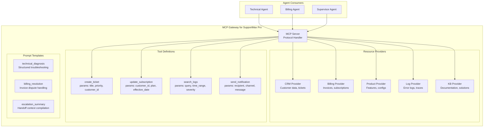
```mermaid
flowchart TB
    subgraph "MCP Gateway for SupportMax Pro"
        MCPServer[MCP Server<br/>Protocol Handler]

        subgraph "Resource Providers"
            CRMProvider[CRM Provider<br/>Customer data, tickets]
            BillingProvider[Billing Provider<br/>Invoices, subscriptions]
            ProductProvider[Product Provider<br/>Features, configs]
            LogProvider[Log Provider<br/>Error logs, traces]
            KBProvider[KB Provider<br/>Documentation, solutions]
        end

        subgraph "Tool Definitions"
            CreateTicket[create_ticket<br/>params: title, priority, customer_id]
            UpdateSubscription[update_subscription<br/>params: customer_id, plan, effective_date]
            SearchLogs[search_logs<br/>params: query, time_range, severity]
            SendNotification[send_notification<br/>params: recipient, channel, message]
        end

        subgraph "Prompt Templates"
            TechDiagnosis[technical_diagnosis<br/>Structured troubleshooting]
            BillingResolution[billing_resolution<br/>Invoice dispute handling]
            Escalation[escalation_summary<br/>Handoff context compilation]
        end
    end

    subgraph "Agent Consumers"
        TechAgent[Technical Agent]
        BillingAgent[Billing Agent]
        Supervisor[Supervisor Agent]
    end

    TechAgent --> MCPServer
    BillingAgent --> MCPServer
    Supervisor --> MCPServer

    MCPServer --> CRMProvider
    MCPServer --> BillingProvider
    MCPServer --> ProductProvider
    MCPServer --> LogProvider
    MCPServer --> KBProvider

    MCPServer --> CreateTicket
    MCPServer --> UpdateSubscription
    MCPServer --> SearchLogs
    MCPServer --> SendNotification
```

**Implementation Milestones for Part 3**:

| Milestone | Deliverable               | Success Criteria                        |
| --------- | ------------------------- | --------------------------------------- |
| M3.1      | Intelligent router        | 95% correct agent selection             |
| M3.2      | Specialist agents (4)     | Each handles domain with 80%+ success   |
| M3.3      | Supervisor orchestration  | Coordinate 3+ agents on complex tickets |
| M3.4      | Message queue integration | < 50ms inter-agent messaging            |
| M3.5      | MCP gateway               | 15+ enterprise integrations             |
| M3.6      | Design patterns library   | Reusable pattern implementations        |
| M3.7      | Load balancing            | Distribute across 10+ agent instances   |

**Quantifiable Outcomes for v3**:

- Handle 10,000 tickets/day
- 82% automated resolution rate
- Multi-agent collaboration success: 90%
- Average agent selection accuracy: 95%
- Cross-domain ticket handling: 88% success
- Average resolution time: 45 minutes
- Customer satisfaction: 4.4/5
- Support cost per ticket: $0.85

**Technology Stack Evolution**:

```yaml
infrastructure:
  compute: Kubernetes (EKS/AKS/GKE)
  database: PostgreSQL 16 (HA cluster)
  cache: Redis Cluster (6 nodes)
  queue: Apache Kafka
  service_mesh: Istio

frameworks:
  orchestration: LangGraph + CrewAI
  multi_agent: AutoGen
  mcp: Official MCP SDK
  api: FastAPI + gRPC

observability:
  logging: ELK Stack
  metrics: Prometheus + Grafana
  tracing: Jaeger
  agent_monitoring: LangSmith
```

---

## Part 4: Production Deployment and Operations

### Vertical Slice Objective

Deploy the multi-agent system to production with enterprise-grade reliability, security, compliance, and operational excellence.

### Architecture v4: Production-Ready System (Chapters 11-13)

**Business Capability**: Fully production-ready system with 99.5% uptime, comprehensive monitoring, automated incident response, and regulatory compliance.

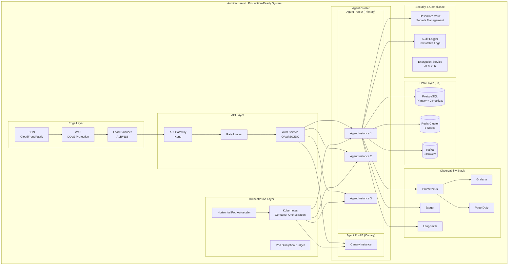
```mermaid
flowchart TB
    subgraph "Architecture v4: Production-Ready System"
        subgraph "Edge Layer"
            CDN[CDN<br/>CloudFront/Fastly]
            WAF[WAF<br/>DDoS Protection]
            LB[Load Balancer<br/>ALB/NLB]
        end

        subgraph "API Layer"
            Gateway[API Gateway<br/>Kong]
            RateLimit[Rate Limiter]
            Auth[Auth Service<br/>OAuth2/OIDC]
        end

        subgraph "Agent Cluster"
            subgraph "Agent Pool A (Primary)"
                AgentA1[Agent Instance 1]
                AgentA2[Agent Instance 2]
                AgentA3[Agent Instance 3]
            end

            subgraph "Agent Pool B (Canary)"
                AgentB1[Canary Instance]
            end
        end

        subgraph "Orchestration Layer"
            K8s[Kubernetes<br/>Container Orchestration]
            HPA[Horizontal Pod Autoscaler]
            PDB[Pod Disruption Budget]
        end

        subgraph "Data Layer (HA)"
            PG[(PostgreSQL<br/>Primary + 2 Replicas)]
            Redis[(Redis Cluster<br/>6 Nodes)]
            Kafka[(Kafka<br/>3 Brokers)]
        end

        subgraph "Observability Stack"
            Prometheus[Prometheus]
            Grafana[Grafana]
            Jaeger[Jaeger]
            PagerDuty[PagerDuty]
            LangSmith[LangSmith]
        end

        subgraph "Security & Compliance"
            Vault[HashiCorp Vault<br/>Secrets Management]
            AuditLog[Audit Logger<br/>Immutable Logs]
            Encryption[Encryption Service<br/>AES-256]
        end
    end

    CDN --> WAF --> LB
    LB --> Gateway
    Gateway --> RateLimit --> Auth
    Auth --> AgentA1
    Auth --> AgentA2
    Auth --> AgentA3
    Auth --> AgentB1

    K8s --> AgentA1
    K8s --> AgentA2
    K8s --> AgentA3
    K8s --> AgentB1

    HPA --> K8s

    AgentA1 --> PG
    AgentA1 --> Redis
    AgentA1 --> Kafka

    AgentA1 --> Prometheus
    Prometheus --> Grafana
    Prometheus --> PagerDuty
    AgentA1 --> Jaeger
    AgentA1 --> LangSmith

    AgentA1 --> Vault
    AgentA1 --> AuditLog
```

**Deployment Architecture Detail**:

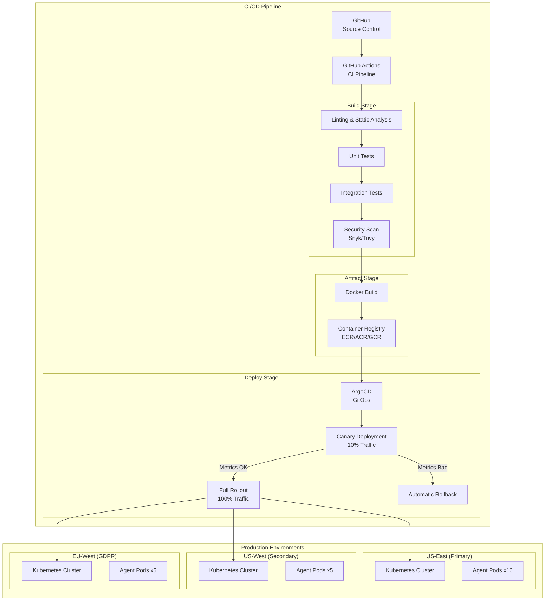
```mermaid
flowchart TB
    subgraph "CI/CD Pipeline"
        GitHub[GitHub<br/>Source Control]
        Actions[GitHub Actions<br/>CI Pipeline]

        subgraph "Build Stage"
            Lint[Linting & Static Analysis]
            UnitTest[Unit Tests]
            IntegTest[Integration Tests]
            SecurityScan[Security Scan<br/>Snyk/Trivy]
        end

        subgraph "Artifact Stage"
            DockerBuild[Docker Build]
            Registry[Container Registry<br/>ECR/ACR/GCR]
        end

        subgraph "Deploy Stage"
            ArgoCD[ArgoCD<br/>GitOps]
            Canary[Canary Deployment<br/>10% Traffic]
            FullRollout[Full Rollout<br/>100% Traffic]
            Rollback[Automatic Rollback]
        end
    end

    subgraph "Production Environments"
        subgraph "US-East (Primary)"
            USE_K8s[Kubernetes Cluster]
            USE_Agents[Agent Pods x10]
        end

        subgraph "US-West (Secondary)"
            USW_K8s[Kubernetes Cluster]
            USW_Agents[Agent Pods x5]
        end

        subgraph "EU-West (GDPR)"
            EU_K8s[Kubernetes Cluster]
            EU_Agents[Agent Pods x5]
        end
    end

    GitHub --> Actions
    Actions --> Lint --> UnitTest --> IntegTest --> SecurityScan
    SecurityScan --> DockerBuild --> Registry
    Registry --> ArgoCD
    ArgoCD --> Canary
    Canary -->|Metrics OK| FullRollout
    Canary -->|Metrics Bad| Rollback

    FullRollout --> USE_K8s
    FullRollout --> USW_K8s
    FullRollout --> EU_K8s
```

**Comprehensive Monitoring Dashboard**:

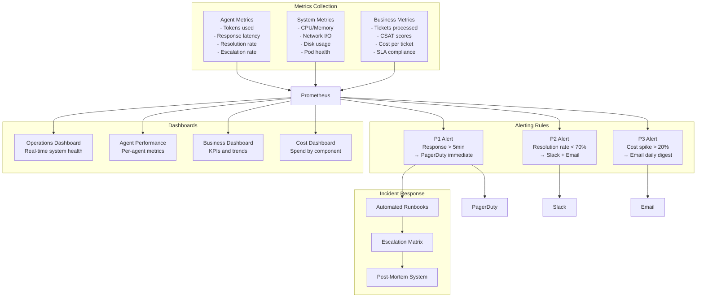
```mermaid
flowchart TB
    subgraph "Metrics Collection"
        AgentMetrics[Agent Metrics<br/>- Tokens used<br/>- Response latency<br/>- Resolution rate<br/>- Escalation rate]

        SystemMetrics[System Metrics<br/>- CPU/Memory<br/>- Network I/O<br/>- Disk usage<br/>- Pod health]

        BusinessMetrics[Business Metrics<br/>- Tickets processed<br/>- CSAT scores<br/>- Cost per ticket<br/>- SLA compliance]
    end

    subgraph "Alerting Rules"
        P1Alert[P1 Alert<br/>Response > 5min<br/>→ PagerDuty immediate]

        P2Alert[P2 Alert<br/>Resolution rate < 70%<br/>→ Slack + Email]

        P3Alert[P3 Alert<br/>Cost spike > 20%<br/>→ Email daily digest]
    end

    subgraph "Dashboards"
        OpsDash[Operations Dashboard<br/>Real-time system health]
        AgentDash[Agent Performance<br/>Per-agent metrics]
        BizDash[Business Dashboard<br/>KPIs and trends]
        CostDash[Cost Dashboard<br/>Spend by component]
    end

    subgraph "Incident Response"
        Runbook[Automated Runbooks]
        Escalation[Escalation Matrix]
        PostMortem[Post-Mortem System]
    end

    AgentMetrics --> Prometheus
    SystemMetrics --> Prometheus
    BusinessMetrics --> Prometheus

    Prometheus --> P1Alert
    Prometheus --> P2Alert
    Prometheus --> P3Alert

    P1Alert --> PagerDuty
    P2Alert --> Slack
    P3Alert --> Email

    Prometheus --> OpsDash
    Prometheus --> AgentDash
    Prometheus --> BizDash
    Prometheus --> CostDash

    P1Alert --> Runbook
    Runbook --> Escalation
    Escalation --> PostMortem
```

**Security and Compliance Architecture**:

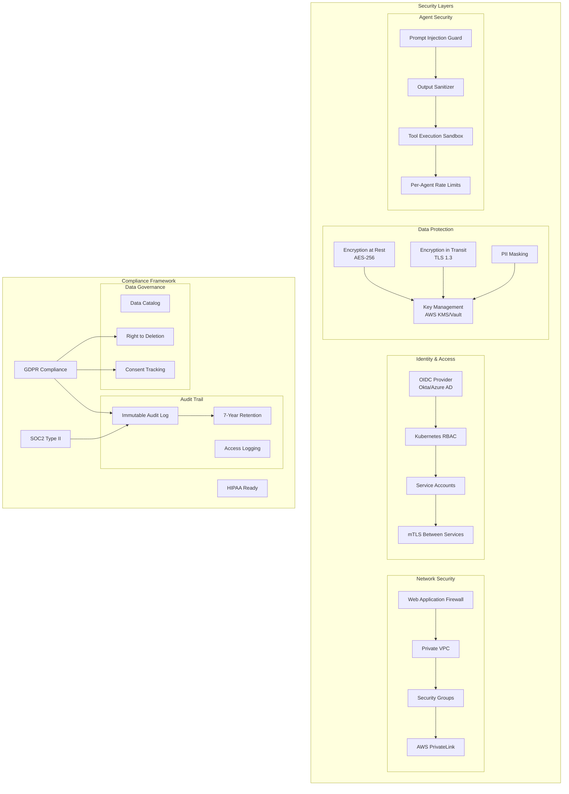
```mermaid
flowchart TB
    subgraph "Security Layers"
        subgraph "Network Security"
            WAF[Web Application Firewall]
            VPC[Private VPC]
            SecurityGroups[Security Groups]
            PrivateLink[AWS PrivateLink]
        end

        subgraph "Identity & Access"
            OIDC[OIDC Provider<br/>Okta/Azure AD]
            RBAC[Kubernetes RBAC]
            ServiceAccounts[Service Accounts]
            MutualTLS[mTLS Between Services]
        end

        subgraph "Data Protection"
            EncryptionAtRest[Encryption at Rest<br/>AES-256]
            EncryptionInTransit[Encryption in Transit<br/>TLS 1.3]
            KeyManagement[Key Management<br/>AWS KMS/Vault]
            DataMasking[PII Masking]
        end

        subgraph "Agent Security"
            PromptGuard[Prompt Injection Guard]
            OutputFilter[Output Sanitizer]
            ToolSandbox[Tool Execution Sandbox]
            RateLimiting[Per-Agent Rate Limits]
        end
    end

    subgraph "Compliance Framework"
        GDPR[GDPR Compliance]
        SOC2[SOC2 Type II]
        HIPAA[HIPAA Ready]

        subgraph "Audit Trail"
            ImmutableLog[Immutable Audit Log]
            RetentionPolicy[7-Year Retention]
            AccessLog[Access Logging]
        end

        subgraph "Data Governance"
            DataCatalog[Data Catalog]
            DeletionWorkflow[Right to Deletion]
            ConsentManagement[Consent Tracking]
        end
    end

    WAF --> VPC
    VPC --> SecurityGroups
    SecurityGroups --> PrivateLink

    OIDC --> RBAC
    RBAC --> ServiceAccounts
    ServiceAccounts --> MutualTLS

    EncryptionAtRest --> KeyManagement
    EncryptionInTransit --> KeyManagement
    DataMasking --> KeyManagement

    PromptGuard --> OutputFilter
    OutputFilter --> ToolSandbox
    ToolSandbox --> RateLimiting

    GDPR --> ImmutableLog
    SOC2 --> ImmutableLog
    ImmutableLog --> RetentionPolicy

    GDPR --> DeletionWorkflow
    GDPR --> ConsentManagement
```

**Production War Story: Billing Integration Failure**

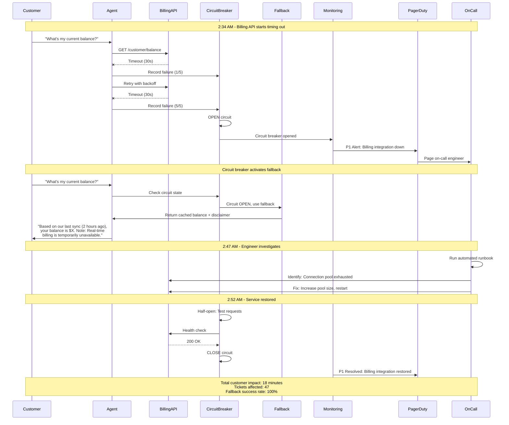
```mermaid
sequenceDiagram
    participant Customer
    participant Agent
    participant BillingAPI
    participant CircuitBreaker
    participant Fallback
    participant Monitoring
    participant PagerDuty
    participant OnCall

    Note over Customer,OnCall: 2:34 AM - Billing API starts timing out

    Customer->>Agent: "What's my current balance?"
    Agent->>BillingAPI: GET /customer/balance
    BillingAPI--xAgent: Timeout (30s)

    Agent->>CircuitBreaker: Record failure (1/5)
    Agent->>BillingAPI: Retry with backoff
    BillingAPI--xAgent: Timeout (30s)

    Agent->>CircuitBreaker: Record failure (5/5)
    CircuitBreaker->>CircuitBreaker: OPEN circuit

    CircuitBreaker->>Monitoring: Circuit breaker opened
    Monitoring->>PagerDuty: P1 Alert: Billing integration down
    PagerDuty->>OnCall: Page on-call engineer

    Note over Customer,OnCall: Circuit breaker activates fallback

    Customer->>Agent: "What's my current balance?"
    Agent->>CircuitBreaker: Check circuit state
    CircuitBreaker->>Fallback: Circuit OPEN, use fallback
    Fallback->>Agent: Return cached balance + disclaimer
    Agent->>Customer: "Based on our last sync (2 hours ago),<br/>your balance is $X. Note: Real-time<br/>billing is temporarily unavailable."

    Note over Customer,OnCall: 2:47 AM - Engineer investigates

    OnCall->>OnCall: Run automated runbook
    OnCall->>BillingAPI: Identify: Connection pool exhausted
    OnCall->>BillingAPI: Fix: Increase pool size, restart

    Note over Customer,OnCall: 2:52 AM - Service restored

    CircuitBreaker->>CircuitBreaker: Half-open: Test requests
    CircuitBreaker->>BillingAPI: Health check
    BillingAPI-->>CircuitBreaker: 200 OK
    CircuitBreaker->>CircuitBreaker: CLOSE circuit

    Monitoring->>PagerDuty: P1 Resolved: Billing integration restored

    Note over Customer,OnCall: Total customer impact: 18 minutes<br/>Tickets affected: 47<br/>Fallback success rate: 100%
```

**Implementation Milestones for Part 4**:

| Milestone | Deliverable           | Success Criteria                    |
| --------- | --------------------- | ----------------------------------- |
| M4.1      | Kubernetes deployment | Multi-region cluster operational    |
| M4.2      | CI/CD pipeline        | < 15 min deploy time, auto-rollback |
| M4.3      | Monitoring stack      | 100+ metrics, < 1 min alert latency |
| M4.4      | Security hardening    | Pass SOC2 audit checklist           |
| M4.5      | GDPR compliance       | Data deletion < 72 hours            |
| M4.6      | Incident automation   | 80% auto-remediation rate           |
| M4.7      | Chaos engineering     | Survive 2-node failure              |
| M4.8      | Load testing          | Handle 3x normal traffic            |

**Quantifiable Outcomes for v4**:

- Handle 50,000 tickets/month
- 99.5% uptime (4.38 hours downtime/year max)
- 85% automated resolution rate
- Average resolution time: 25 minutes
- P1 incident MTTR: < 15 minutes
- Customer satisfaction: 4.5/5
- Support cost per ticket: $0.65
- Full SOC2 Type II compliance
- GDPR compliant with automated data handling

**Production Configuration**:

```yaml
deployment:
  regions:
    - us-east-1 (primary)
    - us-west-2 (secondary)
    - eu-west-1 (GDPR)

  scaling:
    min_replicas: 5
    max_replicas: 50
    target_cpu: 70%
    scale_up_period: 60s
    scale_down_period: 300s

  reliability:
    pod_disruption_budget: 80%
    readiness_probe_interval: 10s
    liveness_probe_interval: 30s
    circuit_breaker_threshold: 5
    circuit_breaker_timeout: 30s

  security:
    secret_manager: HashiCorp Vault
    encryption: AES-256-GCM
    tls_version: "1.3"
    cert_rotation: 30 days

monitoring:
  metrics_retention: 90 days
  log_retention: 1 year
  trace_sampling: 10%
  alert_channels:
    - pagerduty (P1, P2)
    - slack (P2, P3)
    - email (all)
```

---

## Part 5: Advanced Topics and Future Considerations

### Vertical Slice Objective

Optimize the production system for performance, implement comprehensive testing, and establish cost governance.

### Architecture v4-Optimized: High-Performance System (Chapters 14-16)

**Business Capability**: Highly optimized system handling peak loads efficiently with comprehensive quality assurance and cost visibility.

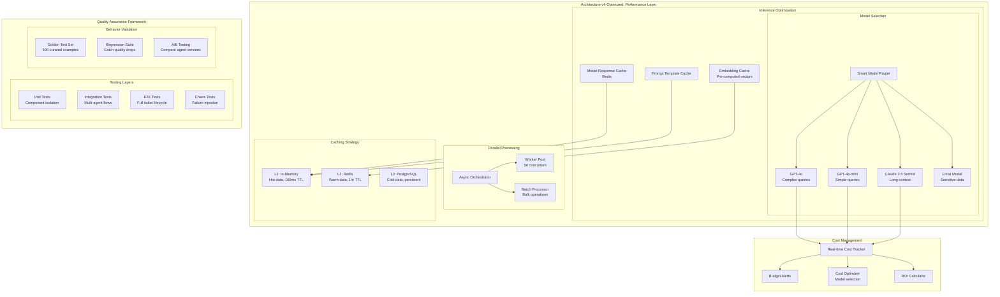
```mermaid
flowchart TB
    subgraph "Architecture v4-Optimized: Performance Layer"
        subgraph "Inference Optimization"
            ModelCache[Model Response Cache<br/>Redis]
            PromptCache[Prompt Template Cache]
            EmbeddingCache[Embedding Cache<br/>Pre-computed vectors]

            subgraph "Model Selection"
                Router[Smart Model Router]
                GPT4[GPT-4o<br/>Complex queries]
                GPT4Mini[GPT-4o-mini<br/>Simple queries]
                Claude[Claude 3.5 Sonnet<br/>Long context]
                Local[Local Model<br/>Sensitive data]
            end
        end

        subgraph "Parallel Processing"
            AsyncOrch[Async Orchestrator]
            WorkerPool[Worker Pool<br/>50 concurrent]
            BatchProcessor[Batch Processor<br/>Bulk operations]
        end

        subgraph "Caching Strategy"
            L1Cache[L1: In-Memory<br/>Hot data, 100ms TTL]
            L2Cache[L2: Redis<br/>Warm data, 1hr TTL]
            L3Cache[L3: PostgreSQL<br/>Cold data, persistent]
        end
    end

    subgraph "Quality Assurance Framework"
        subgraph "Testing Layers"
            UnitTests[Unit Tests<br/>Component isolation]
            IntegTests[Integration Tests<br/>Multi-agent flows]
            E2ETests[E2E Tests<br/>Full ticket lifecycle]
            ChaosTests[Chaos Tests<br/>Failure injection]
        end

        subgraph "Behavior Validation"
            GoldenSet[Golden Test Set<br/>500 curated examples]
            RegressionSuite[Regression Suite<br/>Catch quality drops]
            ABTesting[A/B Testing<br/>Compare agent versions]
        end
    end

    subgraph "Cost Management"
        CostTracker[Real-time Cost Tracker]
        BudgetAlerts[Budget Alerts]
        CostOptimizer[Cost Optimizer<br/>Model selection]
        ROICalculator[ROI Calculator]
    end

    Router --> GPT4
    Router --> GPT4Mini
    Router --> Claude
    Router --> Local

    ModelCache --> L1Cache
    PromptCache --> L1Cache
    EmbeddingCache --> L2Cache

    AsyncOrch --> WorkerPool
    AsyncOrch --> BatchProcessor

    GPT4 --> CostTracker
    GPT4Mini --> CostTracker
    Claude --> CostTracker
    CostTracker --> BudgetAlerts
    CostTracker --> CostOptimizer
    CostTracker --> ROICalculator
```

**Performance Optimization Pipeline**:

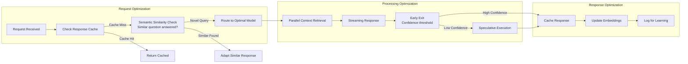
```mermaid
flowchart LR
    subgraph "Request Optimization"
        R1[Request Received]
        R2[Check Response Cache]
        R3[Semantic Similarity Check<br/>Similar question answered?]
        R4[Route to Optimal Model]
    end

    subgraph "Processing Optimization"
        P1[Parallel Context Retrieval]
        P2[Streaming Response]
        P3[Early Exit<br/>Confidence threshold]
        P4[Speculative Execution]
    end

    subgraph "Response Optimization"
        O1[Cache Response]
        O2[Update Embeddings]
        O3[Log for Learning]
    end

    R1 --> R2
    R2 -->|Cache Hit| Response[Return Cached]
    R2 -->|Cache Miss| R3
    R3 -->|Similar Found| Adapt[Adapt Similar Response]
    R3 -->|Novel Query| R4

    R4 --> P1
    P1 --> P2
    P2 --> P3
    P3 -->|High Confidence| O1
    P3 -->|Low Confidence| P4
    P4 --> O1

    O1 --> O2 --> O3
```

**Testing Strategy for Agentic Systems**:

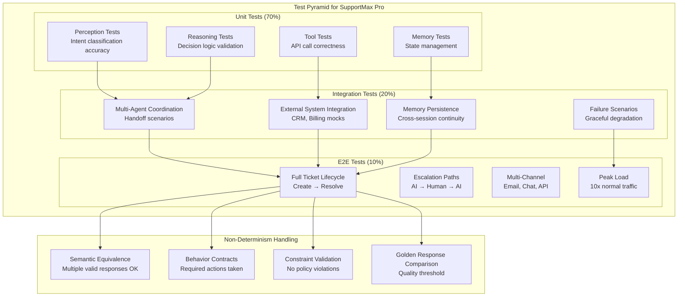
```mermaid
flowchart TB
    subgraph "Test Pyramid for SupportMax Pro"
        subgraph "Unit Tests (70%)"
            UT1[Perception Tests<br/>Intent classification accuracy]
            UT2[Reasoning Tests<br/>Decision logic validation]
            UT3[Tool Tests<br/>API call correctness]
            UT4[Memory Tests<br/>State management]
        end

        subgraph "Integration Tests (20%)"
            IT1[Multi-Agent Coordination<br/>Handoff scenarios]
            IT2[External System Integration<br/>CRM, Billing mocks]
            IT3[Memory Persistence<br/>Cross-session continuity]
            IT4[Failure Scenarios<br/>Graceful degradation]
        end

        subgraph "E2E Tests (10%)"
            E2E1[Full Ticket Lifecycle<br/>Create → Resolve]
            E2E2[Escalation Paths<br/>AI → Human → AI]
            E2E3[Multi-Channel<br/>Email, Chat, API]
            E2E4[Peak Load<br/>10x normal traffic]
        end
    end

    subgraph "Non-Determinism Handling"
        ND1[Semantic Equivalence<br/>Multiple valid responses OK]
        ND2[Behavior Contracts<br/>Required actions taken]
        ND3[Constraint Validation<br/>No policy violations]
        ND4[Golden Response Comparison<br/>Quality threshold]
    end

    UT1 --> IT1
    UT2 --> IT1
    UT3 --> IT2
    UT4 --> IT3

    IT1 --> E2E1
    IT2 --> E2E1
    IT3 --> E2E1
    IT4 --> E2E4

    E2E1 --> ND1
    E2E1 --> ND2
    E2E1 --> ND3
    E2E1 --> ND4
```

**Cost Attribution and Optimization**:

```mermaid
flowchart TB
    subgraph "Cost Tracking"
        subgraph "Per-Ticket Cost Breakdown"
            LLMCost[LLM Inference<br/>$0.15/ticket avg]
            EmbeddingCost[Embeddings<br/>$0.02/ticket avg]
            ComputeCost[Compute<br/>$0.08/ticket avg]
            StorageCost[Storage<br/>$0.01/ticket avg]
            IntegrationCost[API Calls<br/>$0.04/ticket avg]
        end

        subgraph "Cost Optimization Levers"
            ModelSelection[Smart Model Selection<br/>Use mini for simple]
            Caching[Response Caching<br/>30% hit rate target]
            Batching[Request Batching<br/>Reduce API calls]
            Pruning[Context Pruning<br/>Fewer tokens]
        end
    end

    subgraph "ROI Dashboard"
        CostSaved[Cost Saved vs Manual<br/>$1.85/ticket saved]
        Automation[Automation Rate<br/>85% = 42,500 tickets]
        TotalSavings[Monthly Savings<br/>$78,625]
        ROI[ROI<br/>312% annual]
    end

    LLMCost --> TotalCost[Total: $0.30/ticket]
    EmbeddingCost --> TotalCost
    ComputeCost --> TotalCost
    StorageCost --> TotalCost
    IntegrationCost --> TotalCost

    ModelSelection --> Savings[Optimization Savings]
    Caching --> Savings
    Batching --> Savings
    Pruning --> Savings

    TotalCost --> CostSaved
    CostSaved --> TotalSavings
    TotalSavings --> ROI
```

**Implementation Milestones for Part 5**:

| Milestone | Deliverable           | Success Criteria            |
| --------- | --------------------- | --------------------------- |
| M5.1      | Response caching      | 30% cache hit rate          |
| M5.2      | Model routing         | 40% cost reduction          |
| M5.3      | Parallel processing   | 2x throughput               |
| M5.4      | Test automation       | 95% code coverage           |
| M5.5      | Behavior validation   | < 1% regression rate        |
| M5.6      | Cost dashboard        | Real-time per-ticket cost   |
| M5.7      | A/B testing framework | Compare agent versions      |
| M5.8      | Load testing          | Handle 75,000 tickets/month |

**Quantifiable Outcomes for v4-Optimized**:

- Handle 75,000 tickets/month
- Response latency: < 800ms (p95)
- Cache hit rate: 35%
- Cost per ticket: $0.45 (31% reduction)
- Test coverage: 95%
- Regression detection: < 2 hours
- Model cost optimization: 45% savings

---

## Part 6: Reference Architectures and Future Trends

### Vertical Slice Objective

Deploy SupportMax Pro across all major cloud providers with cloud-native services, then unify into a multi-cloud architecture for global scale.

### Architecture v5.1: AWS-Native (Chapter 17)

```mermaid
flowchart TB
    subgraph "AWS Architecture v5.1"
        subgraph "Edge & Ingestion"
            CloudFront[CloudFront CDN]
            WAF[AWS WAF]
            ALB[Application Load Balancer]
            APIGateway[API Gateway]
        end

        subgraph "Compute Layer"
            EKS[Amazon EKS<br/>Kubernetes Cluster]
            Lambda[AWS Lambda<br/>Event Processing]
            Fargate[Fargate<br/>Serverless Containers]
        end

        subgraph "AI/ML Services"
            Bedrock[Amazon Bedrock<br/>Claude, Titan]
            SageMaker[SageMaker<br/>Custom Models]
            Comprehend[Comprehend<br/>Entity Extraction]
            Kendra[Kendra<br/>Enterprise Search]
        end

        subgraph "Data Layer"
            Aurora[(Aurora PostgreSQL<br/>Primary Database)]
            ElastiCache[(ElastiCache Redis<br/>Session & Cache)]
            OpenSearch[(OpenSearch<br/>Vector Search)]
            S3[(S3<br/>Document Storage)]
            DynamoDB[(DynamoDB<br/>High-speed Lookups)]
        end

        subgraph "Messaging"
            SQS[SQS<br/>Task Queues]
            SNS[SNS<br/>Notifications]
            EventBridge[EventBridge<br/>Event Routing]
            MSK[MSK (Kafka)<br/>Streaming]
        end

        subgraph "Observability"
            CloudWatch[CloudWatch<br/>Metrics & Logs]
            XRay[X-Ray<br/>Distributed Tracing]
            Grafana[Managed Grafana<br/>Dashboards]
        end

        subgraph "Security"
            Cognito[Cognito<br/>User Auth]
            SecretsManager[Secrets Manager]
            KMS[KMS<br/>Encryption Keys]
            IAM[IAM Roles]
        end
    end

    CloudFront --> WAF --> ALB
    ALB --> APIGateway
    APIGateway --> EKS
    APIGateway --> Lambda

    EKS --> Bedrock
    EKS --> SageMaker
    Lambda --> Comprehend
    Lambda --> Kendra

    EKS --> Aurora
    EKS --> ElastiCache
    EKS --> OpenSearch
    Lambda --> DynamoDB
    Lambda --> S3

    EKS --> SQS
    Lambda --> SNS
    EventBridge --> Lambda
    EKS --> MSK

    EKS --> CloudWatch
    Lambda --> XRay

    APIGateway --> Cognito
    EKS --> SecretsManager
    Aurora --> KMS
```

### Architecture v5.2: Azure-Native (Chapter 18)

```mermaid
flowchart TB
    subgraph "Azure Architecture v5.2"
        subgraph "Edge & Ingestion"
            FrontDoor[Azure Front Door]
            WAF[Azure WAF]
            AppGateway[Application Gateway]
            APIM[API Management]
        end

        subgraph "Compute Layer"
            AKS[Azure Kubernetes Service]
            Functions[Azure Functions]
            ContainerApps[Container Apps]
        end

        subgraph "AI/ML Services"
            AzureOpenAI[Azure OpenAI Service<br/>GPT-4, Embeddings]
            CogServices[Cognitive Services<br/>Language, Vision]
            AISearch[Azure AI Search<br/>Vector + Semantic]
            MLStudio[Azure ML Studio]
        end

        subgraph "Data Layer"
            CosmosDB[(Cosmos DB<br/>Multi-model)]
            SQLServer[(Azure SQL<br/>Relational)]
            RedisCache[(Azure Cache Redis)]
            BlobStorage[(Blob Storage)]
        end

        subgraph "Messaging"
            ServiceBus[Service Bus<br/>Enterprise Messaging]
            EventHubs[Event Hubs<br/>Streaming]
            EventGrid[Event Grid<br/>Event Routing]
        end

        subgraph "Observability"
            AppInsights[Application Insights]
            LogAnalytics[Log Analytics]
            AzureMonitor[Azure Monitor]
        end

        subgraph "Security"
            EntraID[Microsoft Entra ID]
            KeyVault[Key Vault]
            ManagedIdentity[Managed Identity]
        end

        subgraph "Copilot Integration"
            CopilotStudio[Copilot Studio<br/>Low-code Agents]
            M365Copilot[M365 Integration]
        end
    end

    FrontDoor --> WAF --> AppGateway
    AppGateway --> APIM
    APIM --> AKS
    APIM --> Functions

    AKS --> AzureOpenAI
    AKS --> CogServices
    Functions --> AISearch

    AKS --> CosmosDB
    AKS --> SQLServer
    AKS --> RedisCache
    Functions --> BlobStorage

    AKS --> ServiceBus
    Functions --> EventHubs
    EventGrid --> Functions

    AKS --> AppInsights
    Functions --> LogAnalytics

    APIM --> EntraID
    AKS --> KeyVault
    AKS --> ManagedIdentity

    CopilotStudio --> AKS
    AKS --> M365Copilot
```

### Architecture v5.3: GCP-Native (Chapter 19)

```mermaid
flowchart TB
    subgraph "GCP Architecture v5.3"
        subgraph "Edge & Ingestion"
            CloudCDN[Cloud CDN]
            CloudArmor[Cloud Armor]
            GCLB[Global Load Balancer]
            APIGateway[Apigee API Gateway]
        end

        subgraph "Compute Layer"
            GKE[Google Kubernetes Engine]
            CloudFunctions[Cloud Functions]
            CloudRun[Cloud Run]
        end

        subgraph "AI/ML Services"
            VertexAI[Vertex AI<br/>Gemini, PaLM]
            AgentBuilder[Agent Builder<br/>Conversational AI]
            DocumentAI[Document AI]
            VectorSearch[Vertex AI Vector Search]
        end

        subgraph "Data Layer"
            CloudSQL[(Cloud SQL PostgreSQL)]
            Firestore[(Firestore)]
            Memorystore[(Memorystore Redis)]
            CloudStorage[(Cloud Storage)]
            BigQuery[(BigQuery<br/>Analytics)]
        end

        subgraph "Messaging"
            PubSub[Pub/Sub<br/>Messaging]
            CloudTasks[Cloud Tasks<br/>Task Queues]
            Eventarc[Eventarc<br/>Event Routing]
        end

        subgraph "Observability"
            CloudMonitoring[Cloud Monitoring]
            CloudLogging[Cloud Logging]
            CloudTrace[Cloud Trace]
        end

        subgraph "Security"
            IAP[Identity-Aware Proxy]
            SecretManager[Secret Manager]
            CloudIAM[Cloud IAM]
        end
    end

    CloudCDN --> CloudArmor --> GCLB
    GCLB --> APIGateway
    APIGateway --> GKE
    APIGateway --> CloudFunctions

    GKE --> VertexAI
    GKE --> AgentBuilder
    CloudFunctions --> DocumentAI
    GKE --> VectorSearch

    GKE --> CloudSQL
    GKE --> Firestore
    GKE --> Memorystore
    CloudFunctions --> CloudStorage
    GKE --> BigQuery

    GKE --> PubSub
    CloudFunctions --> CloudTasks
    Eventarc --> CloudFunctions

    GKE --> CloudMonitoring
    CloudFunctions --> CloudLogging
    GKE --> CloudTrace

    APIGateway --> IAP
    GKE --> SecretManager
```

### Architecture v6: Multi-Cloud Global Deployment (Chapter 20)

```mermaid
flowchart TB
    subgraph "Architecture v6: Multi-Cloud Global"
        subgraph "Global Traffic Management"
            GlobalDNS[Global DNS<br/>Route53/Traffic Manager]
            GeoRouting[Geo-based Routing]
        end

        subgraph "Cloud Abstraction Layer"
            K8sAbstraction[Kubernetes Abstraction<br/>Portable Workloads]
            TerraformModules[Terraform Modules<br/>IaC Abstraction]
            SecretSync[Secret Synchronization]
        end

        subgraph "AWS Region (US-East)"
            AWS_EKS[EKS Cluster]
            AWS_Bedrock[Bedrock]
            AWS_Aurora[Aurora]
        end

        subgraph "Azure Region (EU-West)"
            Azure_AKS[AKS Cluster]
            Azure_OpenAI[Azure OpenAI]
            Azure_Cosmos[Cosmos DB]
        end

        subgraph "GCP Region (APAC)"
            GCP_GKE[GKE Cluster]
            GCP_Vertex[Vertex AI]
            GCP_Spanner[Cloud Spanner]
        end

        subgraph "Cross-Cloud Data Sync"
            DataSync[Real-time Data Sync<br/>CockroachDB/Spanner]
            EventMesh[Event Mesh<br/>Cross-cloud events]
            CDNSync[CDN Cache Sync]
        end

        subgraph "Unified Observability"
            Datadog[Datadog<br/>Multi-cloud monitoring]
            CentralLogs[Central Log Aggregation]
            GlobalDashboard[Global Dashboard]
        end

        subgraph "Disaster Recovery"
            ActiveActive[Active-Active<br/>All regions serving]
            Failover[Automatic Failover<br/>< 30s RTO]
            DataBackup[Cross-region Backup]
        end
    end

    GlobalDNS --> GeoRouting
    GeoRouting -->|Americas| AWS_EKS
    GeoRouting -->|Europe| Azure_AKS
    GeoRouting -->|Asia-Pacific| GCP_GKE

    K8sAbstraction --> AWS_EKS
    K8sAbstraction --> Azure_AKS
    K8sAbstraction --> GCP_GKE

    TerraformModules --> AWS_EKS
    TerraformModules --> Azure_AKS
    TerraformModules --> GCP_GKE

    AWS_Aurora <--> DataSync
    Azure_Cosmos <--> DataSync
    GCP_Spanner <--> DataSync

    AWS_EKS <--> EventMesh
    Azure_AKS <--> EventMesh
    GCP_GKE <--> EventMesh

    AWS_EKS --> Datadog
    Azure_AKS --> Datadog
    GCP_GKE --> Datadog

    Datadog --> GlobalDashboard
    CentralLogs --> GlobalDashboard

    ActiveActive --> Failover
    Failover --> DataBackup
```

**Multi-Cloud Deployment Configuration**:

```yaml
multi_cloud_config:
  primary_region: aws-us-east-1
  secondary_regions:
    - azure-westeurope
    - gcp-asia-southeast1

  traffic_distribution:
    aws: 40%
    azure: 35%
    gcp: 25%

  failover:
    rto: 30s
    rpo: 1s
    health_check_interval: 10s

  data_sync:
    technology: CockroachDB
    replication_lag_target: 100ms
    conflict_resolution: last-write-wins

  abstraction_layer:
    kubernetes: true
    iac: terraform
    secrets: external-secrets-operator

  cost_optimization:
    reserved_capacity: 60%
    spot_instances: 20%
    on_demand: 20%

  compliance:
    eu_data_residency: azure-westeurope
    us_data_residency: aws-us-east-1
    apac_data_residency: gcp-asia-southeast1
```

**Implementation Milestones for Part 6**:

| Milestone | Deliverable               | Success Criteria               |
| --------- | ------------------------- | ------------------------------ |
| M6.1      | AWS v5.1 deployment       | Full feature parity with v4    |
| M6.2      | Azure v5.2 deployment     | Full feature parity with v4    |
| M6.3      | GCP v5.3 deployment       | Full feature parity with v4    |
| M6.4      | Data synchronization      | < 100ms replication lag        |
| M6.5      | Global traffic management | Geo-routing operational        |
| M6.6      | Cross-cloud failover      | < 30s RTO tested               |
| M6.7      | Unified observability     | Single-pane-of-glass dashboard |
| M6.8      | Cost optimization         | 25% savings vs single-cloud    |

**Final Quantifiable Outcomes for v6**:

- Handle 100,000+ tickets/month
- Global availability: 99.99% uptime
- Response latency: < 500ms (p95, global)
- Automated resolution: 85%
- Customer satisfaction: 4.6/5
- Cost per ticket: $0.40
- Resolution time: 15 minutes average
- Multi-region disaster recovery: 30s RTO
- Full compliance: SOC2, GDPR, HIPAA-ready

---

## Summary: Architecture Evolution Matrix

| Version | Part | Tickets/Day | Resolution Rate | Avg Resolution Time | Cost/Ticket | CSAT | Key Capability            |
| ------- | ---- | ----------- | --------------- | ------------------- | ----------- | ---- | ------------------------- |
| v0.5    | 1    | 100         | 50%             | 4 hours             | $0.80       | 3.5  | Basic FAQ bot             |
| v1      | 1    | 500         | 70%             | 2 hours             | $0.65       | 3.8  | Full ticket pipeline      |
| v2      | 2    | 2,000       | 78%             | 1.5 hours           | $0.55       | 4.2  | Memory & context          |
| v3      | 3    | 10,000      | 82%             | 45 min              | $0.50       | 4.4  | Multi-agent orchestration |
| v4      | 4    | 50,000      | 85%             | 25 min              | $0.45       | 4.5  | Production-ready          |
| v4-Opt  | 5    | 75,000      | 85%             | 20 min              | $0.42       | 4.5  | Performance optimized     |
| v5.x    | 6    | 90,000      | 85%             | 18 min              | $0.40       | 4.5  | Cloud-native              |
| v6      | 6    | 100,000+    | 85%             | 15 min              | $0.40       | 4.6  | Multi-cloud global        |

This roadmap demonstrates the progressive enhancement of SupportMax Pro from a simple chatbot to an enterprise-grade, globally distributed, multi-cloud intelligent support platform—providing readers with a practical understanding of how to build production-ready agentic AI systems at scale.