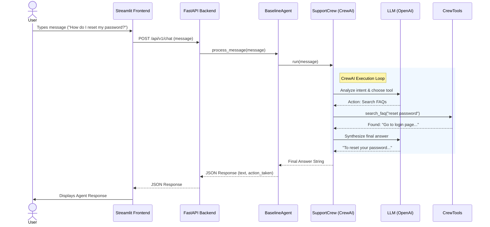

# v0.5 Baseline Agent Interaction Diagram

This diagram illustrates the request/response flow for the SupportMax Pro v0.5 Baseline Agent, incorporating the CrewAI integration.

## Component Roles

1.  **Streamlit Frontend**: Captures user input and displays chat history.
2.  **FastAPI Backend**: Exposes the agent logic via a REST API.
3.  **BaselineAgent**: Wrapper class that maintains the API interface and orchestrates the Crew.
4.  **SupportCrew**: The CrewAI container that defines the Agent, Task, and Process.
5.  **LLM**: The brain (OpenAI GPT-4) that decides which tool to use.
6.  **CrewTools**: Wrappers for the `FAQStore` and `TicketCreator` to make them compatible with CrewAI.
