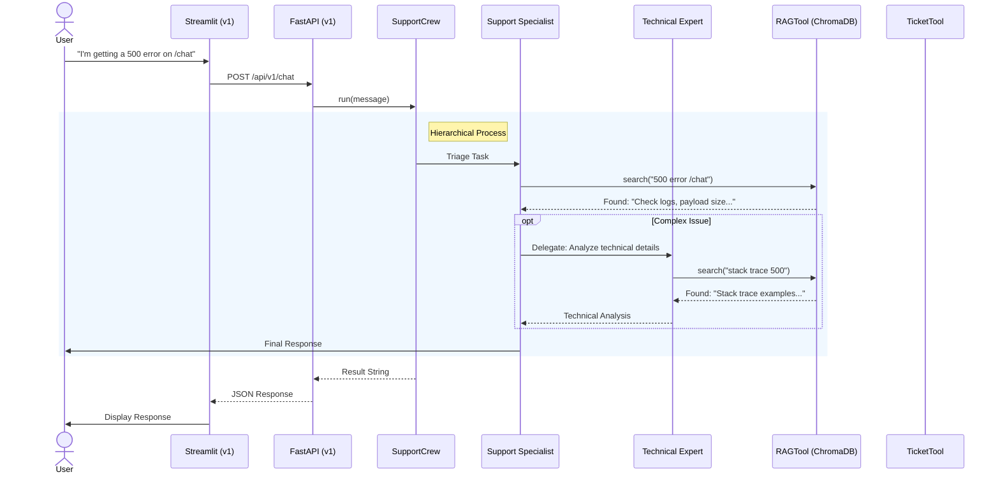

# v1 MVP Agent Interaction Diagram

This diagram illustrates the multi-agent flow in SupportMax Pro v1.0, featuring RAG and hierarchical delegation.

## Key Components
1.  **Support Specialist**: Front-line agent. Uses RAG for general queries. Delegates complex issues.
2.  **Technical Expert**: Specialist agent for deep dives.
3.  **RAGTool**: Retrieves context from ChromaDB (ingested docs).
4.  **Hierarchical Process**: Allows agents to delegate tasks dynamically.
